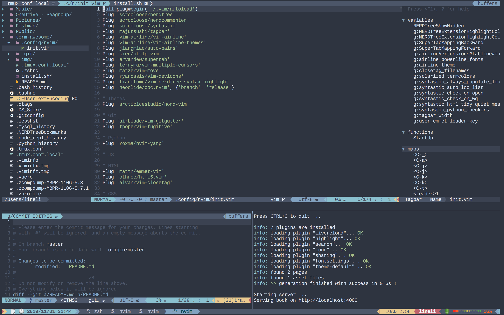
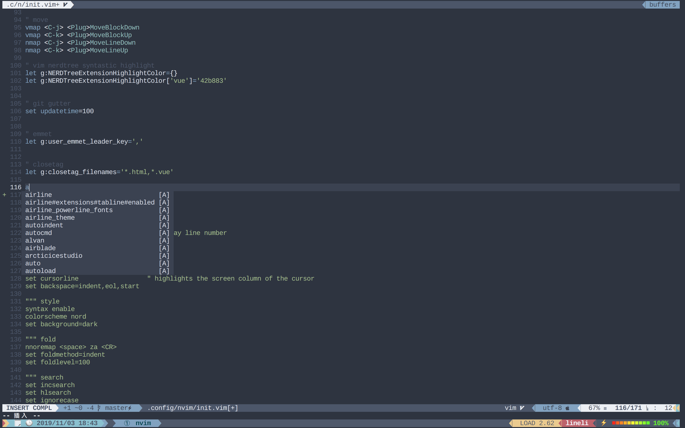

# Term Awesome



## Packages

### `iTerm2`

[iTerm2](https://iterm2.com/) is the terminal works on Macs with many awesome features you always wanted.

### `zsh`

[Z-shell (zsh)](http://www.zsh.org/) is a unix shell extended Bourne shell with many improvements., including some features of [bash](https://www.gnu.org/software/bash/), [ksh](https://www.well.ox.ac.uk/~johnb/comp/unix/ksh.html), and [tcsh](https://www.tcsh.org).

### `tmux`

[tmux](https://github.com/tmux/tmux) is a terminal multiplexer for Unix-like operating systems. It allows multiple terminal sessions to be accessed simultaneously in a single window.

### `neovim`

[neovim](https://neovim.io) is a powerful text editor based on vim. It refactored the codebase and added a couple of new, highly expected functionalities to it.

### `git`

[git](https://git-scm.com) is most popular VCS (Version Control System).

### `python3`
[Python](https://www.python.org) is a programming language that lets you work quickly and integrate systems more effectively.

### `node`

[node.js](https://nodejs.org) is a JavaScript runtime built on Chrome's V8 JavaScript engine.


## Prerequisites

1. Install [iTerm2](https://www.iterm2.com/)
2. Install [Nord Iterm2 color scheme](https://github.com/arcticicestudio/nord-iterm2)
3. Install [Nerd Font](https://github.com/ryanoasis/nerd-fonts) (I use `Fira Code` for awesome operator display!)

## Installation

```shell=
$ cd
$ git clone https://github.com/L-Eli/term-awesome.git
$ cd term-awesome
$ ./install.sh
```

## Customized

### zsh

* [`oh-my-zsh`](https://ohmyz.sh) - Is a delightful, open source, community-driven framework for managing your zsh configuration.

* [`zsh-autosuggestions`](https://github.com/zsh-users/zsh-autosuggestions) - Suggests commands as you type based on history and completions.
  
* [`zsh-syntax-highlighting`](https://github.com/zsh-users/zsh-syntax-highlighting) - Fish shell liked syntax highlighting for zsh.

* [`powerlevel9k`](https://github.com/Powerlevel9k/powerlevel9k) - Is a theme for zsh. It's highly customizable and beautiful...

### tmux
* [`oh-my-tmux`](https://github.com/gpakosz/.tmux) - Self-contained, pretty and versatile `.tmux.conf` configuration file. You can also made it by yourself.
  
### neovim

Installed both `python neovim client` & `node neovim package` to make sure neovim can communicate with them.

I used [vim-plug](https://github.com/junegunn/vim-plug) to manage my plugins for neovim.

#### Plugins

* [`nerdtree`](https://github.com/scrooloose/nerdtree) - A tree explorer plugin for vim. It opened automatically when you open the project without assign any files. You can use `ctrl` + `a` to toggle it.

* [`nerdcommenter`](https://github.com/scrooloose/nerdcommenter) - A plugin that allows for easy commenting of code for many filetypes. I use `ctrl + /` as my shortcut.

* [`syntastic`](https://github.com/vim-syntastic/syntastic) - Automatic syntax checking for vim.

* [`tagbar`](https://github.com/majutsushi/tagbar) - Displays tags in a window. It also opened automatically when you open the project without assign any files. You can toggle it with `ctrl + t` to toggle it.

* [`vim-airline`](https://github.com/vim-airline/vim-airline) - Is a powerful status and tab line for Vim. There're some shortcuts you can manipulate current tab:
  * `\ + [` - Go to previous tab.
  * `\ + ]` - Go to next tab.
  * `\ + 1~8` - Go to specific tab via number.
  * `\ + 9` - Go to the last tab.
  
* [`auto-pair`](https://github.com/jiangmiao/auto-pairs) - Insert or delete brackets, parens, quotes in pair.

* [`ctrlp`](https://github.com/kien/ctrlp.vim) - Full path fuzzy file, buffer, mru, tag, ... finder for Vim.

* [`supertab`](https://github.com/ervandew/supertab) - Perform all your vim insert mode completions with Tab.

* [vim-multiple-cursors`](https://github.com/terryma/vim-multiple-cursors) - Multiple selections for Vim.

* [`vim-move`](https://github.com/matze/vim-move) - Move lines and selections up and down. I use `ctrl + j` & `ctrl + k` to munipulate the line(s) in visual mode.

* [`vim-devicons`](https://github.com/ryanoasis/vim-devicons) - It adds file type icons to Vim plugins. It works with patched font like `nerd font`. That's why I pin it as `prerequisite` above.

* [`vim-nerdtree-syntax-highlight`](https://github.com/tiagofumo/vim-nerdtree-syntax-highlight) - Extra syntax and highlight for nerdtree files.

* [`coc-nvim`](https://github.com/neoclide/coc.nvim) - Intellisense engine for vim8 & neovim, full language server protocol support as VSCode!

* [`nord-vim`(https://github.com/arcticicestudio/nord-vim) - My theme of vim.

* [`vim-gitgutter`](https://github.com/airblade/vim-gitgutter) - Shows a git diff in the gutter.

* [`vim-fugitive`](https://github.com/tpope/vim-fugitive) - A Git wrapper. It shows over airline by the way.

* [`nvim-yarp`](https://github.com/roxma/nvim-yarp) - Yet Another Remote Plugin Framework for Neovim.

* [`emmet-vim`](https://github.com/mattn/emmet-vim) - Emmet is a plugin which greatly improves HTML & CSS workflow.

* [`html5.vim`](https://github.com/othree/html5.vim) - HTML5 omnicomplete and syntax.

* [`vim-closetag`](https://github.com/alvan/vim-closetag) - Auto close (X)HTML tags.

* [`vim-css-color`](https://github.com/ap/vim-css-color) - Preview colours in source code.

> All plugins & customized options are declared inside `~/.config/nvim/init.vim`. You can extend it and customize it manually.

#### Coc



There several language servers I've installed. If you want to extend, use `:CocInstall coc-{ServerName}` in vim.

> All Coc servers were store in `~/.config/coc/extensions/`
